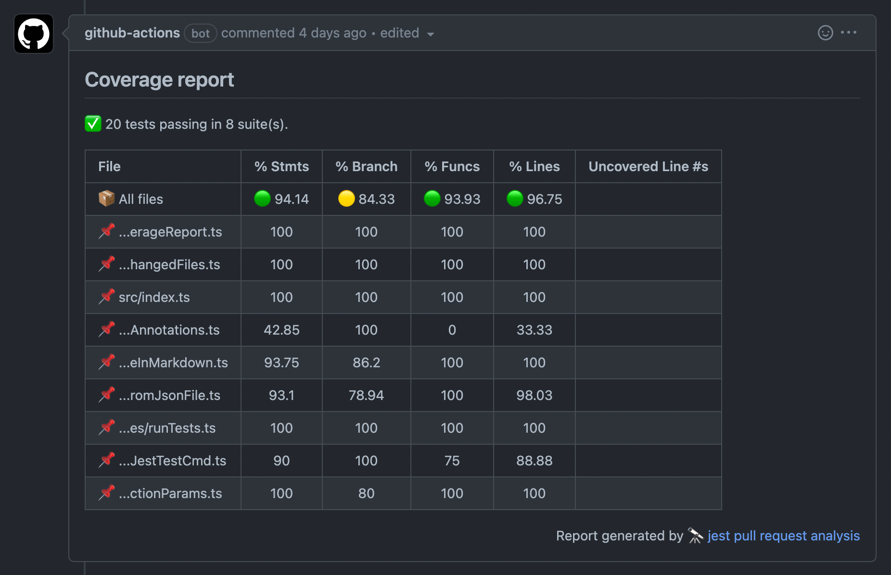
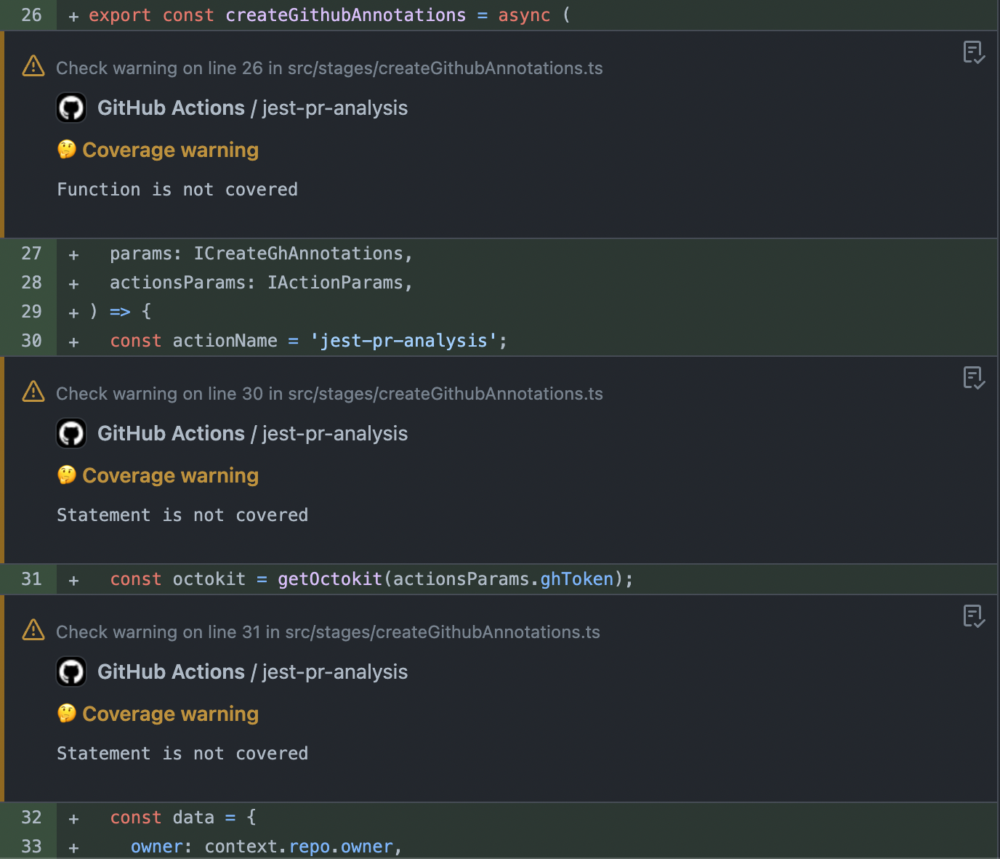

# Jest Pull Request Analysis

This Action allows you to create annotations and coverage reports based on Jest's output.

<p align="center">
  
</p>

<p align="center">
  
</p>

**Features:**

- ✅ Reporting code coverage on **each pull request**
- ✅ Show spoiler comment in **non tested file**
- ✅ Show spoiler comment in **non coverage file**
- ✅ Reject pull request, if **coverage is not met to threshold**

## Usage

1. Install and configure [Jest](https://github.com/facebook/jest) in your project.</br>
   1.1. Configure jest in your package.json. \[Required\]
   > NOTE: For now this action don't support `jest.config.js|ts|mjs|cjs|json` file config.

```json
"name": "your project name",
"jest": {
  "testRegex": "",
  "collectCoverageFrom": [],
  "coverageThreshold": {}
}
```

2. Create action inside `.github/workflows`:
   > NOTE: For now this action only support `on: pull_request` trigger.

```yml
name: PR analysis

on:
  pull_request:
    types: [opened, reopened, synchronize]

jobs:
  annotate-pr:
    runs-on: ubuntu-latest
    name: Run tests on pull request
    steps:
      - name: Checkout
        uses: actions/checkout@v3

      - uses: actions/setup-node@v3
        with:
          node-version: '18'
          cache: 'yarn'

      - run: yarn install

      - name: Jest PR analysis
        uses: Manogel/jest-pr-analysis@v1.1.1
```

## License

MIT © [Manogel](https://github.com/Manogel)
